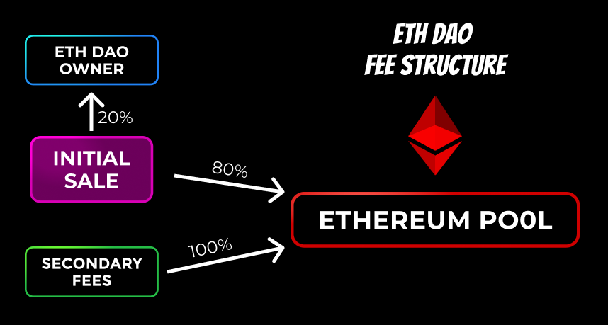

# ETHDAO

  

# Purpose
- The goal was to create a DAO to collect secondary fees and than allow the tokenholders decide what to do with the funds.
- NFT Floor price is backed by the money in the Ethereum Pool
- Floor price cannot go below the total value in the pool divided by the shares minted.
- Secondary sale royalties go into the pool increasing the Floor Price
- The current iteration just stores money in the contract and allows people to vote when to withdraw funds stored in contract for token holders.
- I'd like to convert this into a a DAO that takes the funds allows tokenholders to manage the fund, maybe for a charity, maybe for some business idea.

# Tech Stack
- Solidity
- Truffle
- Ganache
- Hope you enjoy it!!!

# Vote to Withdraw Shares
- 3 year time limit before shareholders can withdraw funds
- Contract owner can open the contract to a vote with a 1 week time limit
- Unclaimed funds can be withdrawn by contract owner 25 weeks after withdrawal period has been opened
- Rug Proof smart contract
- Funds are stored in the contract preventing theft

# Future Plans
- Develop a frontend for the app and probably throw it on IPFS.
- Maybe remove the ability to have the contract owner open a vote to sell and just set voting periods in the contract
- Create fun generative art for the nft and rename the contract. (Need a designer)
- Maybe the money generated by the contract should be a more purposeful DAO, that uses the funds to create something or donate to charity
